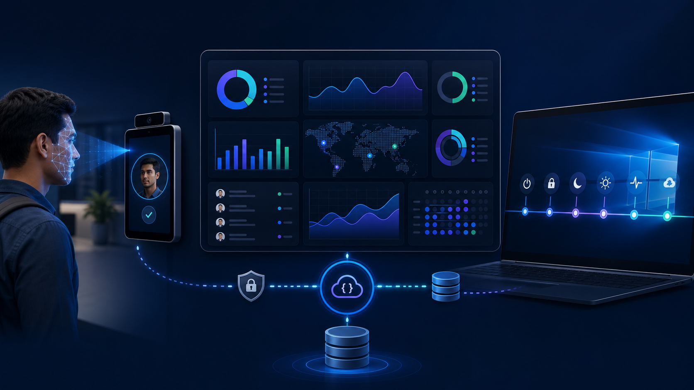
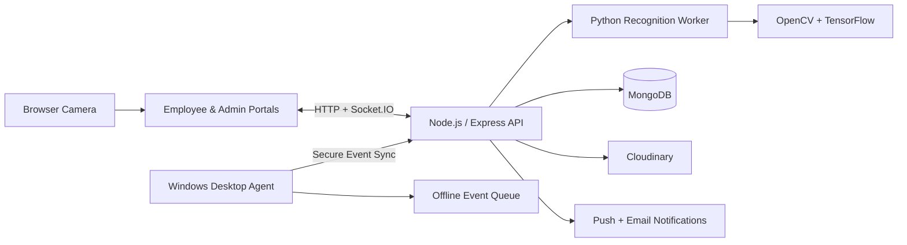

<div align="center">

# FaceAI Workforce Intelligence Platform

### Face Recognition Attendance · Windows Activity Monitoring · HRMS · Real-Time Analytics

A full-stack workforce operations platform that connects biometric attendance, employee work sessions, Windows device events, HR workflows, and live administrative insights in one system.

</div>



## About the Project

FaceAI is an existing end-to-end attendance and workforce activity platform built for organizations that need reliable identity verification, automated attendance, structured work-session tracking, and operational visibility.

The application combines a Node.js and Express backend, MongoDB persistence, Python-based face recognition, a Windows desktop agent, role-based employee and admin dashboards, real-time Socket.IO updates, and notification services.

## Key Highlights

- Face enrollment and camera-based attendance
- TensorFlow MobileNetV2 facial embeddings and cosine-similarity matching
- Persistent Python recognition worker for low-latency scans
- Face-quality checks for blur, lighting, size, and occlusion
- Employee and administrator role-based portals
- Windows startup, shutdown, restart, sleep, wake, lock, unlock, logon, and logoff detection
- Offline desktop-event storage with automatic backend synchronization
- Live desktop-agent heartbeat and presence status
- Daily work sessions, plans, checkout reports, and productivity metrics
- Attendance, lateness, overtime, weekend, and leave management
- Real-time notifications through Socket.IO, Firebase, and Web Push
- CSV, Excel-compatible, and printable report exports
- Docker Compose and Kubernetes-ready microservices migration scaffold

## Architecture



### Desktop activity flow

```text
Windows Event Sources
        ↓
Desktop Activity Agent
        ↓
Local Offline Queue (when required)
        ↓
Express System Events API
        ↓
MongoDB + Work Session Processing
        ↓
Real-Time Admin Dashboard
```

## Technology Stack

| Area | Technologies |
| --- | --- |
| Backend | Node.js 20, Express 5, Socket.IO |
| Frontend | EJS, HTML, CSS, JavaScript |
| Database | MongoDB, Mongoose |
| Face recognition | Python, OpenCV, TensorFlow, MobileNetV2, NumPy |
| Liveness modules | MediaPipe, OpenCV image analysis |
| Authentication | bcrypt, signed HTTP-only authentication cookies, RBAC |
| Desktop agent | Node.js, PowerShell, Windows Event Viewer, Win32 APIs |
| Media | Cloudinary |
| Notifications | Firebase Admin, Web Push, Nodemailer, node-cron |
| Infrastructure | Docker Compose, Kubernetes, RabbitMQ, Redis, MinIO |

## Product Features

### Face Recognition and Attendance

- Browser-based biometric enrollment
- Frontal and profile face detection
- Employee-specific face labels
- Cloud-backed enrollment image storage
- Automatic embedding generation and model refresh
- Confidence threshold and ambiguity-margin validation
- Face-login support for employees
- Duplicate attendance prevention per employee and date
- Attendance confidence, device, location, and recognition metadata
- Attendance history and exports

The active recognition worker performs face detection, identity matching, and image-quality validation. The repository also includes interactive MediaPipe liveness challenges and static anti-spoofing utilities for deployment-specific capture flows.

### Windows Desktop Activity Agent

The Node-based Windows agent collects and normalizes:

- Computer startup and boot time
- Shutdown, unexpected shutdown, and restart
- Sleep and wake with sleep-duration recovery
- `SessionLock` and `SessionUnlock`
- `SessionLogon` and `SessionLogoff`
- Session connection and disconnection
- Active and idle usage
- Foreground application changes
- Application process start and stop
- Supported browser foreground activity
- Network and internet connectivity changes
- Agent online/offline state and heartbeat

Events include machine, session, employee, operating-system, source-log, and timestamp metadata. When the backend is unavailable, the agent buffers events locally and retries them after connectivity returns. Backend ingestion is idempotent through unique external event IDs.

### Work Sessions and HRMS

- Automatic daily work-session initialization after attendance
- Employee daily plans and join-work flow
- Active, idle, sleep, break, incomplete, offline, and checkout states
- Employee monitoring-permission state
- Active, idle, inactive, and sleep duration totals
- Configurable working hours and grace periods
- Late-arrival and overtime calculation
- Daily checkout summaries and pending-work reports
- Leave application, cancellation, approval, and rejection
- Weekend and holiday work calculations
- Employee and admin HRMS reports

### Admin Dashboard

- Workforce overview and live status
- Employee and biometric enrollment management
- Attendance monitoring
- Complete system-event timeline
- Power, session, activity, application, and network filters
- Performance and productivity analytics
- Leave-management dashboard
- Daily reports and overtime views
- Work-schedule configuration
- Real-time notifications and desktop-agent presence

### Employee Portal

- Personal dashboard
- Attendance and attendance history
- Face enrollment
- Work-session controls
- Daily plan and checkout report
- Leave requests and leave history
- Overtime and activity history
- Profile and device information

## Repository Structure

```text
face-micro/
├── admin/                           # Admin routes, controllers, and views
├── emp/                             # Employee portal
├── agents/windows-activity-agent/   # Windows desktop collector
├── routes/                          # Page and JSON API routes
├── controllers/                     # Authentication controllers
├── middleware/                      # Authentication, roles, errors, rate limits
├── models/                          # Mongoose models
├── services/                        # Business logic and service entry points
├── sockets/                         # Socket.IO authentication and events
├── python/                          # Face capture, training, recognition, liveness
├── public/                          # Frontend assets
├── config/                          # Database and environment configuration
├── docs/                            # Architecture and developer documentation
├── infra/                           # Docker Compose and Kubernetes manifests
└── index.js                         # Main Express application
```

## Getting Started

### Requirements

- Node.js 20.x
- npm
- Python 3.12 recommended
- MongoDB local instance or MongoDB Atlas
- Windows for native desktop monitoring
- Webcam for enrollment and attendance

### 1. Install Node dependencies

```powershell
npm install
```

### 2. Configure environment variables

Create `.env` from `.env.example` and provide your own credentials:

```powershell
Copy-Item .env.example .env
```

Minimum local configuration:

```dotenv
PORT=8080
NODE_ENV=development
AUTH_SECRET=<long-random-secret>
MONGO_URI=mongodb://127.0.0.1:27017/faceAttendance
SYSTEM_EVENTS_COLLECTOR_TOKEN=<long-random-collector-token>
PYTHON_EXECUTABLE=.venv\Scripts\python.exe
FACE_CONFIDENCE_THRESHOLD=0.78
FACE_CONFIDENCE_MARGIN=0.02
RECOGNITION_TIMEOUT_MS=12000
```

### 3. Prepare Python

Automated setup:

```powershell
npm run setup:python
```

Manual setup:

```powershell
py -3.12 -m venv .venv
Set-ExecutionPolicy -Scope Process -ExecutionPolicy Bypass
.\.venv\Scripts\Activate.ps1
pip install -r python\requirements.txt
```

### 4. Run the application

```powershell
npm start
```

Open the configured port:

```text
http://localhost:8080/login
http://localhost:8080/admin-login
```

If `.env` sets another `PORT`, use that port instead.

## Desktop Agent Setup

```powershell
cd agents\windows-activity-agent
npm install
Copy-Item .env.example .env
```

Configure the agent:

```dotenv
FACEAI_SERVER_URL=http://localhost:8080
FACEAI_COLLECTOR_TOKEN=<same-token-as-the-server>
FACEAI_EMPLOYEE_ID=<employee-roll-number>
FACEAI_EMPLOYEE_NAME=<employee-name>
FACEAI_POLL_INTERVAL_SECONDS=15
FACEAI_IDLE_THRESHOLD_SECONDS=120
```

Run a diagnostic collection:

```powershell
npm run once
```

Run continuously:

```powershell
npm start
```

Install at Windows logon from elevated PowerShell:

```powershell
powershell.exe -ExecutionPolicy Bypass -File .\scripts\install-startup-task.ps1
```

Agent logs, state, and offline events are stored in:

```text
%LOCALAPPDATA%\FaceAIActivityAgent
```

## Main API Groups

| Base path | Responsibility |
| --- | --- |
| `/api/students` | Employee registration and enrollment |
| `/api/attendance` | Attendance queries, scans, marking, and exports |
| `/api/work-sessions` | Daily work sessions and activity events |
| `/api/system-events` | Desktop event ingestion, timeline, summary, and exports |
| `/api/hrms` | Leave, reports, overtime, and HRMS summaries |
| `/api/notifications` | Notification inbox and delivery tokens |
| `/api/work-schedule` | Organization work-schedule settings |

Trusted desktop collectors send batches to:

```http
POST /api/system-events/ingest
X-Collector-Token: <SYSTEM_EVENTS_COLLECTOR_TOKEN>
```

## Important Data Models

| Model | Purpose |
| --- | --- |
| `User` | Authentication, role, and account state |
| `Student` | Employee profile and biometric enrollment |
| `Attendance` | Daily attendance and recognition metadata |
| `WorkSession` | Work state, durations, and activity timeline |
| `SystemEvent` | Normalized Windows and HRMS events |
| `DailyWorkReport` | Checkout and task summary |
| `LeaveRequest` | Employee leave workflow |
| `WorkSchedule` | Shift and grace-period configuration |
| `Notification` | Notification inbox and delivery state |
| `Analytics` | Productivity and activity aggregates |

## Available Commands

```powershell
npm start                 # Start the main application
npm run setup:python      # Install Python dependencies
npm run py:capture        # Capture a face dataset
npm run py:train          # Generate face embeddings
npm run py:recognize      # Run the camera recognition utility
npm run py:system-events  # Run the Python event monitor
npm run agent:windows     # Run the Node Windows agent
npm run microservices:up  # Start the Compose topology
```

## Microservices Direction

The current application runs as a modular monolith. The repository also includes an incremental microservices design with entry points or scaffolds for:

- API Gateway
- Authentication
- Employee registry
- Attendance and work sessions
- Notifications
- Analytics
- Audit logging
- System events
- Face training
- Face recognition
- Reporting and file storage

Local infrastructure includes RabbitMQ, Redis, MinIO, and domain-oriented MongoDB instances:

```powershell
docker compose -f infra/docker-compose.microservices.yml up --build
```

The migration plan preserves current business behavior while progressively moving routes, persistence, and asynchronous workflows into service-owned boundaries.

## Engineering Considerations

- Unique MongoDB indexes prevent duplicate daily attendance, work sessions, reports, and system events.
- Desktop events remain recoverable during network outages.
- Recognition runs through a warmed worker instead of a Python process per request.
- Model changes trigger worker reloads.
- Browser and collector Socket.IO connections use separate authentication paths.
- Role middleware protects employee and admin areas.
- Request size limits, rate limiting, and centralized error handling are configured.
- The microservices design includes health endpoints and deployment templates.

## Security

- Keep `.env`, biometric model data, and real credentials outside Git.
- Use unique, long values for `AUTH_SECRET` and `SYSTEM_EVENTS_COLLECTOR_TOKEN`.
- Enable HTTPS and secure cookies in production.
- Restrict database, Cloudinary, Firebase, SMTP, and Socket.IO access.
- Apply organization-approved biometric and activity-data retention policies.
- Obtain employee notice and consent before enabling desktop monitoring.

## Documentation

- [Microservices Architecture](docs/microservices-architecture.md)
- [Microservices Contracts](docs/microservices-contracts.md)
- [Service Catalog](docs/service-catalog.md)
- [API Documentation](docs/api-docs.md)
- [Deployment Guide](docs/deployment-guide.md)
- [Developer Guide](docs/developer-guide.md)
- [Windows Agent Guide](agents/windows-activity-agent/README.md)
- [Anti-Spoofing Guide](ANTI_SPOOFING_GUIDE.md)

## Roadmap

- Complete domain ownership for extracted services
- Expand automated unit, integration, API, and browser testing
- Add CI/CD, dependency scanning, and container security checks
- Add distributed logging, metrics, traces, and alerting
- Integrate configurable multi-frame liveness into the primary browser flow
- Add organization-level retention and privacy controls
- Add desktop-agent fleet health and managed updates
- Benchmark face-recognition accuracy across representative environments

## License

The project package currently declares the ISC license.

---

<div align="center">
Built as an end-to-end demonstration of computer vision, backend engineering, real-time systems, Windows automation, data modeling, and workforce analytics.
</div>
